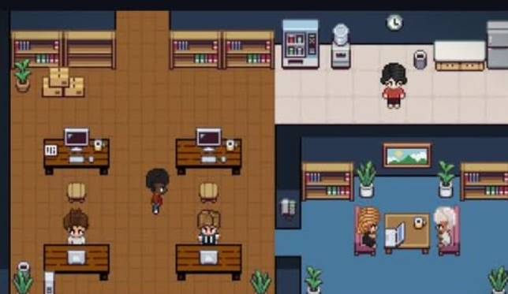

# csm-office

> A realtime pixel-art office that visualizes Claude Code agent sessions as
> characters walking between rooms.

csm-office is a browser game-frontend that mirrors live agent activity from
[`claude-session-manager`](https://github.com/dongquoctien/claude-session-manager)
(csm). Each session becomes a pixel character placed in a room by its activity;
characters walk between rooms as activity changes, speech bubbles show recent
messages. It is a **read-only viewer** — it consumes csm's `/api/stream` (SSE)
and does **not** parse `~/.claude` logs itself.



## How it works

```
csm agent /api/stream ──proxy(token injected)──► SSE client ──► worldStore (pure)
                                                                   │ diff → intents
                                                                   ▼
                                                        Phaser OfficeScene + HUD
```

- **3 zones** map the 9 csm activities by what the work is:
  - **Coding** (wood) — `writing`, `running`, `searching`
  - **Meeting / Reading** (blue) — `reading`, `browsing`, `thinking`, `spawning`
  - **Kitchen / Break** (tile) — `idle`, `waiting`
- Only agents that are active or touched in the last 30 min are shown.
- Avatar appearance is deterministic per session id (stable across reconnects).

## Run it

Requires Node 20+ and a **running csm agent** (it binds `127.0.0.1:4777` and
prints a per-run token on launch).

```bash
npm install
cp .env.example .env      # then paste your csm token into CSM_TOKEN
npm run dev               # http://localhost:5173
```

The dev server proxies `/api/*` to the csm agent and injects the token
server-side (it never reaches client JS). The csm token is **per-run random** —
re-paste it into `.env` each time you restart csm. Without a token the office
still boots; it shows mock agents until a real stream connects.

### Production

```bash
npm run build             # → dist/
CSM_TOKEN=… CSM_AGENT_URL=http://127.0.0.1:4777 npm run serve   # Hono server :5180
```

## Scripts

| Script | What |
|---|---|
| `npm run dev` | Vite dev server + SSE proxy |
| `npm run build` | Typecheck + production bundle |
| `npm test` | Vitest (pure store/diff/look/slots/routing logic) |
| `npm run lint` | ESLint + Prettier check |
| `npm run serve` | Serve `dist/` + proxy via Hono |

## Architecture

Strict layers (Phaser is confined to `src/game/`):

- `src/api/` — SSE client + wire types (owned here, re-declared not imported).
- `src/store/` — pure reducer (`worldStore`), `diff` → intents, `look` (hash).
- `src/game/` — Phaser scene, sprites, zones, routing, bubbles.
- `src/hud/` — DOM overlay (connection, legend, filters, panel, setup).
- `server/` — Hono prod server (static + SSE proxy).

csm-office is **source-independent** of csm: no dependency, import, or submodule.
The only coupling is the runtime HTTP/SSE call to a running csm agent. See
`PLAN.md` for the full design and the verified API contract.

## Assets

Currently uses generated placeholders. To use a real pixel tileset/sprite sheet,
drop files into `public/assets/` and fill in `src/game/assets.ts` `MANIFEST` —
no other code changes. Record licenses in `ASSETS.md`.

## License

MIT
